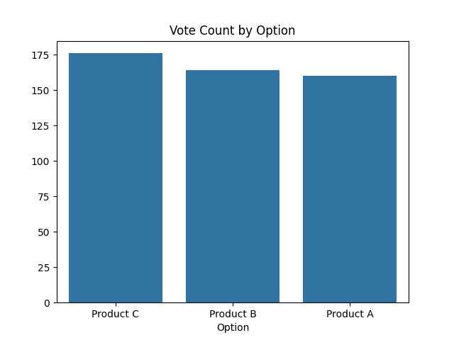
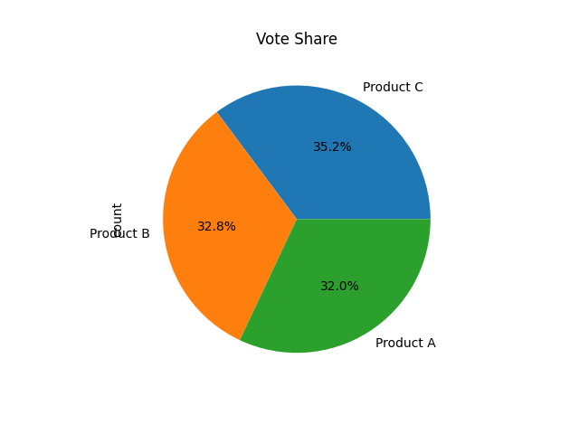
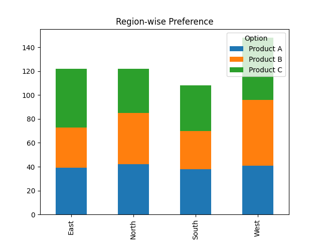
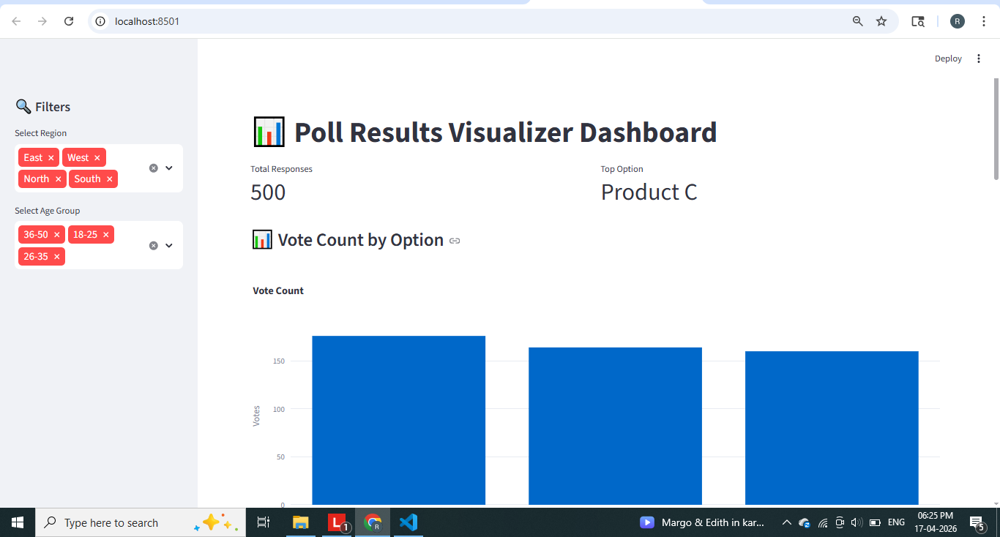
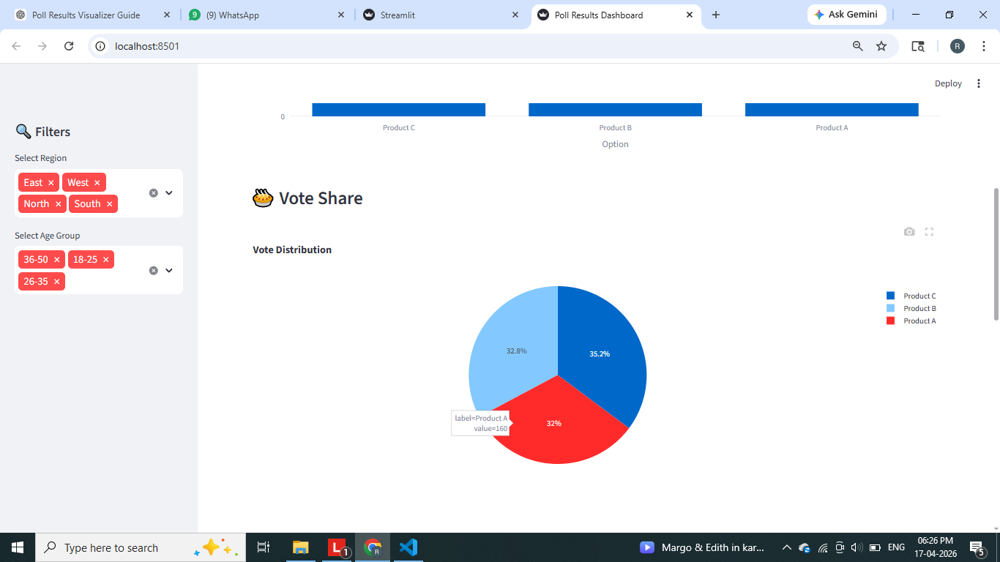
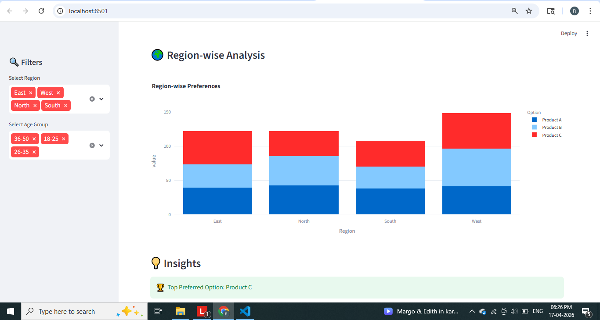
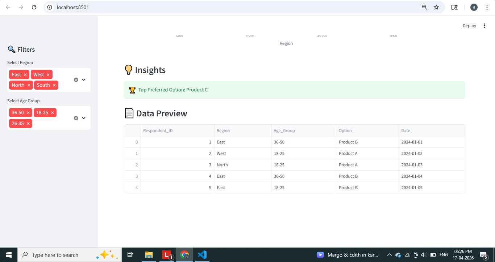

# 📊 Poll Results Visualizer

## 🚀 Overview

The **Poll Results Visualizer** is a data analytics project designed to analyze and visualize poll or survey data using Python. It processes structured datasets (CSV/Google Forms exports), performs data analysis, and presents insights through interactive dashboards and charts.

This project demonstrates real-world data analysis workflows including preprocessing, aggregation, visualization, and insight generation.

---

## ❓ Problem Statement

Organizations collect large amounts of survey data but often struggle to:

* Understand trends quickly
* Compare responses across demographics
* Extract actionable insights

---

## 💡 Solution

This project solves the problem by:

* Cleaning and structuring poll data
* Performing statistical analysis (counts, percentages)
* Visualizing results using charts and dashboards
* Providing insights for decision-making

---

## ✨ Features

* 📂 Synthetic dataset generation
* 🧹 Data cleaning & preprocessing
* 📊 Vote/share percentage calculation
* 📈 Visualizations:

  * Bar chart
  * Pie chart
  * Region-wise stacked chart
* 🌍 Demographic filtering (Region, Age Group)
* 🖥️ Interactive Streamlit dashboard
* 💡 Automated insight generation

---

## 🛠️ Tech Stack

* Python
* Pandas
* NumPy
* Matplotlib
* Seaborn
* Plotly
* Streamlit

---

## 📁 Project Structure

```
Poll-Results-Visualizer/
│
├── data/              # Dataset
├── src/               # Core logic modules
├── app/               # Streamlit dashboard
├── outputs/           # Generated charts
├── images/            # Screenshots
├── main.py            # Main pipeline
├── requirements.txt
└── README.md
```

---

## ⚙️ Installation

### 1. Clone Repository

```
git clone https://github.com/your-username/Poll-Results-Visualizer.git
cd Poll-Results-Visualizer
```

### 2. Create Virtual Environment

```
python -m venv env
env\Scripts\activate   # Windows
```

### 3. Install Dependencies

```
pip install -r requirements.txt
```

---

## ▶️ How to Run

### Run Data Pipeline

```
python main.py
```

### Run Dashboard

```
streamlit run app/app.py
```

---

## 📊 Outputs

* Poll dataset (CSV)
* Bar chart (vote count)
* Pie chart (vote share)
* Region-wise comparison chart
* Interactive dashboard

---

## 📸 Screenshots








---

## 💡 Sample Insights

* Identified most preferred option
* Compared regional preferences
* Analyzed demographic trends

---

## 🎯 Use Cases

* Election poll analysis
* Customer feedback surveys
* Employee satisfaction analysis
* Product preference studies
* Academic survey analysis

---

## 🧠 Learning Outcomes

* Data preprocessing using Pandas
* Exploratory Data Analysis (EDA)
* Data visualization techniques
* Building modular Python projects
* Creating interactive dashboards

---

## 🚀 Future Improvements

* Upload custom CSV files
* Real-time polling system
* Sentiment analysis on text responses
* API integration
* Power BI dashboard integration

---

## 🐞 Troubleshooting

### ModuleNotFoundError

```
pip install -r requirements.txt
```

### Streamlit not running

```
python -m streamlit run app/app.py
```

### File not found

Ensure:

```
data/poll_data.csv exists
```

---

## 👨‍💻 Author

Rakshitha A S

---

## ⭐ If you like this project

Give it a ⭐ on GitHub and share!
